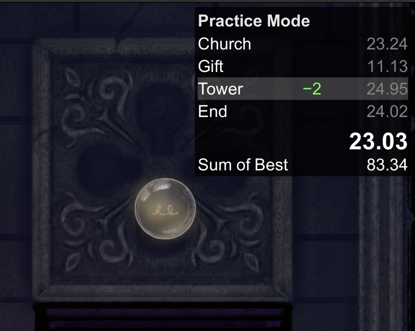

# TigerMoth

A speedrun practice and timer mod for *To The Flame*.

## Features

### Better Splits

Adds three more splits to the game, with a LiveSplit-inspired in-game timer:

Now you can track your PBs, both for full-game runs and individual splits!

### Practice Mode

Press `1`–`5` to load a checkpoint and enter Practice Mode. The checkpoints are
placed just before each split (plus one at the end, for practicing that last
jump!), and the timer starts as soon as you enter the split. In Practice Mode,
the timer shows your best split times, as well as your sum-of-best.

In addition to the hardcoded checkpoints, you can use `H` and `I` to
quicksave, for practicing tricky sections.

### Ghost

Yes! Your best runs are recorded so that you can race against them. When starting
a new run (via New Game or `R`), you will race against your PB ghost. In Practice
Mode, you will race against your gold split ghosts. The ghost is updated whenever
you get a new PB or a new gold split (either in a normal run or Practice Mode).

If the ghost is distracting, you can toggle its visibility with `G`. You can also
replay the current ghost recording directly with `F`.

### Camera Zoom

- `[` — Zoom in
- `]` — Zoom out

Very helpful for seeing more of the surrounding geometry. Note that any zoom
level other than 0 will disable the game's dynamic zoom logic (e.g. widening the
zoom when the Spider is nearby).

### Disclaimer

Not exhaustively tested. Might have weird interactions with other game settings.
If something seems clearly wrong, open an issue!

## Install (pre-built)

1. Install [BepInEx 5.x for macOS](https://github.com/BepInEx/BepInEx/releases) into your game directory
2. Copy `TigerMoth.dll` into `BepInEx/plugins/TigerMoth/`
3. Launch with `./run_bepinex.sh`

## Build from source

1. Clone this repo next to your `To The Flame.app`
2. `dotnet build -c Release` in the `TigerMoth/` directory
3. The DLL is automatically copied to `BepInEx/plugins/TigerMoth/`
